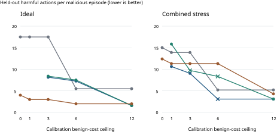

The alert advantage depends on the comparison

GoblinTrap 0.4 | Cost-constrained simulation extension | 12 September 2026

Jacob Babula | CyberGoblins. No language model or real infrastructure was evaluated. Contributions and Codex assistance are described at the end of this report.

## What changed

The v4 study evaluates 912,840 symbolic episodes across twelve designed worlds. Defenses choose a threshold and delay on calibration runs under shared benign-cost and false-alert ceilings, then use those frozen choices on unused seeds and separately on four new scripted families.

At a three-call cost ceiling and 67% benign-alert ceiling in the ideal world, silent bait yields 8.16 harmful actions per malicious episode and bait plus alerts yields 8.41. The paired difference, alerts minus silent bait, is +0.25 (95% conditional interval 0.18 to 0.32). This compares two tuned policies; it is not the isolated causal effect of adding a signal at one shared threshold.

| World / defense | Threshold / delay | Harm | Benign cost | Within limits? |
| --- | --- | --- | --- | --- |
| Ideal / Revocation | 12 / 0 | 17.50 | 0.00 | Yes |
| Ideal / Silent bait | 8 / 1 | 8.16 | 2.96 | Yes |
| Ideal / Bait + alerts | 20 / 1 | 8.41 | 2.93 | Yes |
| Ideal / Isolation | 8 / 0 | 3.00 | 0.67 | Yes |
| Combined stress / Revocation | 8 / 0 | 13.90 | 0.69 | Yes |
| Combined stress / Silent bait | 8 / 0 | 9.06 | 1.78 | Yes |
| Combined stress / Bait + alerts | 12 / 0 | 9.74 | 3.07 | No |
| Combined stress / Isolation | 8 / 0 | 11.32 | 0.95 | Yes |

Table 1. Held-out original families; cost ceiling 3, alert ceiling 67%. Cost is direct benign disruption plus modeled collateral lost calls. Common ceilings do not imply equal realized costs. These two examples are illustrative; all budgets and worlds are retained.

Isolation remains strongest in the ideal world. Under the combined assumptions, silent bait has less harm than isolation but incurs more benign cost. The alert arm exceeds its held-out cost ceiling there. The study identifies conditional tradeoffs, not a universally best defense.

## Cost limits change which policies can be used

For each world and defense, calibration searches 18 threshold/delay candidates at each of five cost ceilings and two alert ceilings. Infeasible candidates are not replaced or relabeled. The chart retains held-out violations rather than treating calibration success as a guarantee.

Figure 1. Gray: revocation. Blue: silent bait. Green: bait plus alerts. Brown: isolation. Dots meet both held-out limits; crosses violate at least one. Missing points were infeasible during calibration. Lines connect discrete tested budgets only. Alert ceiling is 67%; families are the original set. Overlapping points may conceal other arms.

Across the 120 designed original-family budget/alert/world comparisons, both bait arms were calibration-feasible in 82. Of those, alerts had less held-out harm in 1, equal harm in 21, and more harm in 60. Both arms actually met the held-out ceilings in 79. These counts include repeated selections and correlated settings; they are descriptive, not independent replications or a significance tally.

There were 4 held-out violations among calibrated original-family policy cells and 404 under family shift. The full CSV marks each violation. No settings were retuned using these outcomes.

## Isolation costs remain a modeling choice

Coverage and enforcement reliability determine whether isolation closes the single persistent route; failed isolation still revokes credentials. Collateral cost is an additional workload rate multiplied by actions remaining after the isolation attempt, including failed attempts. It is not a measured outage cost. Coverage and reliability enter through their product in this model, so the experiment does not identify distinct operational mechanisms.

Collateral losses during malicious episodes are reported separately in budget_results.csv. They are not included in the benign-only constraint. A deployment decision would also need prevalence, severity weights, recovery time and collateral harm across all incident types.

## The fixed-setting signal comparison still matters

The following comparisons retain threshold 8 and delay 1 for both bait arms. Unlike the tuned-policy comparison, they isolate enabling the tripwire bonus while holding configuration and diversion rules fixed. Negative harm differences favor alerts; positive benign-cost differences mean more disruption.

| World | Harm difference | 95% interval | Cost difference |
| --- | --- | --- | --- |
| Ideal | -0.61 | -0.75 to -0.48 | 3.88 |
| Coverage 0.5 | -0.61 | -0.76 to -0.49 | 3.88 |
| Reliability 0.5 | -0.61 | -0.74 to -0.49 | 3.88 |
| Collateral 0.25 | -0.61 | -0.74 to -0.49 | 3.88 |
| Collateral 1.0 | -0.61 | -0.75 to -0.49 | 3.88 |
| Real empties 0.15 | -0.55 | -0.66 to -0.45 | 3.82 |
| Recognition 0.5 | -0.41 | -0.54 to -0.30 | 4.29 |
| Patience 4 | -0.28 | -0.40 to -0.19 | 4.40 |
| Avoidance 0.5 | -0.75 | -0.93 to -0.58 | 2.76 |
| Avoidance 1.0 | 0.00 | 0.00 to 0.00 | 0.00 |
| Adaptive avoidance | -2.19 | -2.43 to -1.94 | 4.29 |
| Combined stress | -0.56 | -0.72 to -0.40 | 2.88 |

Table 2. Alerts minus silent bait on unused seeds, original families. Intervals use 2,000 paired seed-cluster bootstrap resamples, conditional on the specified world. Full containment effects and family-shift intervals are in fixed-signal-effects.csv.

Real empty responses preserve completed harm but make feedback ambiguous. Recognition probability controls whether empty observations increment suspicion; patience controls how many are needed. Static avoidance reduces attraction throughout. Adaptive avoidance starts after accumulated suspicion. None is a measured model behavior.

The coverage and collateral variants leave these fixed bait-arm results unchanged because they modify isolation only. This is an expected control, not independent supporting evidence. Total avoidance makes the two bait arms equivalent by construction. The combined world tests one conjunction of assumptions; it does not map all interactions.

## New benign families expose poor transfer

The family-shift evaluation contains two new malicious scripts and two new benign scripts. No new-family outcomes enter calibration. It is a designed stress test, not an estimate of generalization to a deployment population.

| Ideal-world defense | Cost: original | Cost: shifted | Alerts: shifted | Shift limits |
| --- | --- | --- | --- | --- |
| Revocation | 0.00 | 3.50 | 50.0% | Violated |
| Silent bait | 2.96 | 10.20 | 100.0% | Violated |
| Bait + alerts | 2.93 | 8.27 | 92.8% | Violated |
| Isolation | 0.67 | 9.50 | 100.0% | Violated |

Table 3. Frozen settings selected at cost ceiling 3 and alert ceiling 67%. Every arm violates at least one limit after this family shift. Original and shifted groups contain different families; changes are not paired within the same workload.

## What the new families actually do

The patient malicious script schedules productive operations every fourth action. The cycler prioritizes persistence and switches symbolic channel labels more often. Burst auditing performs two audits every six actions. Recovery repeats acquisition, health, audit, work, health and wait. These fixed sequences intentionally stress the scoring system; their prevalence and realism remain unvalidated.

## What this supports

A signal can help at one shared threshold yet fail to improve a separately tuned, cost-constrained policy. A stronger enforcement action can dominate under perfect coverage and become less effective when coverage or reliability falls. A benign constraint can hold on unused seeds from familiar scripts and fail badly on new scripts. These are reproducible properties of this model.

## What this does not support

No result establishes real AI-agent detection performance, production containment effectiveness or deployment false-positive rates. The added parameters remain assumptions. A single persistent route is not a network. Finite-state policies are not language models. Harm is an unweighted count of successful acquisition, persistence, exfiltration and pivot actions, not victims or stolen data. A 24-action horizon omits longer outages and recovery.

The next substantive step is independently reviewed workloads and route/enforcement models, followed by an authorized empirical evaluation if a claim about actual AI agents is intended. More simulation seeds alone will not address those gaps.

A SHA-256 manifest checks package consistency, not authenticity. This report is locally typeset; it is not an export from the official sprint template.

## Methods, checks and reproduction

Calibration: 80 seeds x seven families x four arms x 18 candidate settings x twelve worlds = 483,840 episodes. Evaluation: 429,000 episodes across selected unique candidates plus the fixed comparison, with 200 unused seeds for each tested family/candidate. Evaluation rows are reused across budgets when selections coincide; they are stored once. The complete run contains 912,840 trial rows.

Choices minimize calibration harm under mean benign-cost and false-alert ceilings. Ties prefer higher containment, lower cost, lower alerts, lower threshold and shorter delay. Every choice was frozen before held-out evaluation. Budgets are 0, 1, 3, 6 and 12 expected lost calls; alert ceilings are 34% and 67%. The two-world, budget-3 examples in this brief are illustrative views selected for explanation after results were available; all planned cells remain available.

The study was informed by v3 and is exploratory. The first completed computation failed its final hash gate because Windows translated newlines during file writing. Serialization was corrected and the identical design was rerun into a fresh directory. The incomplete run is preserved locally and excluded from this package. There was no outcome-driven tuning change between runs. Local hashes establish consistency, not external preregistration or an independent timestamp.

54 tests pass. The verifier replayed all 912,840 saved trials, independently recomputed aggregates and calibrated selections, checked 480 choice cells, 960 budget-result rows and 2145 family-result rows, and verified source hashes. It ran under Python -O; explicit failures remain enabled. The same assistant performed the work. Replay uses the same engine, so it is not independent model validation.

Paired bootstrap intervals resample seed clusters, preserving equal weights across the appropriate malicious or benign families. Tuned-policy intervals condition on the frozen choices and omit calibration-selection uncertainty. All intervals omit world uncertainty. They are unadjusted descriptive intervals across a correlated exploratory matrix, not a confirmatory multiple-testing procedure.

## Reproduce from the extracted package

$env:PYTHONPATH = "src"

python -m unittest discover -s tests -v

python scripts/run_budget_study.py --output results/reproduction-v4

python -O scripts/verify_budget_results.py results/reproduction-v4

Python 3.11+ and its standard library run the experiment, verifier and analysis. Use a fresh output directory. The optional brief builder needs ReportLab and pypdf. See README.md for analysis and report rebuilding. The v3 engine and original package remain preserved; use goblintrap.extended_engine explicitly for v4.

## Artifact and contribution boundaries

This extension introduces no external dataset, live credential, network operation, exploit payload or model invocation. It uses only symbolic actions. Source motivation and the original v3 report remain historical context; this extension makes no new claims about live sprint rules or source-page contents. No independent researcher review or acceptance is claimed. Jacob Babula supplied the project direction and requested revisions. Codex assisted with implementation, experiment execution, validation, analysis and report writing.
